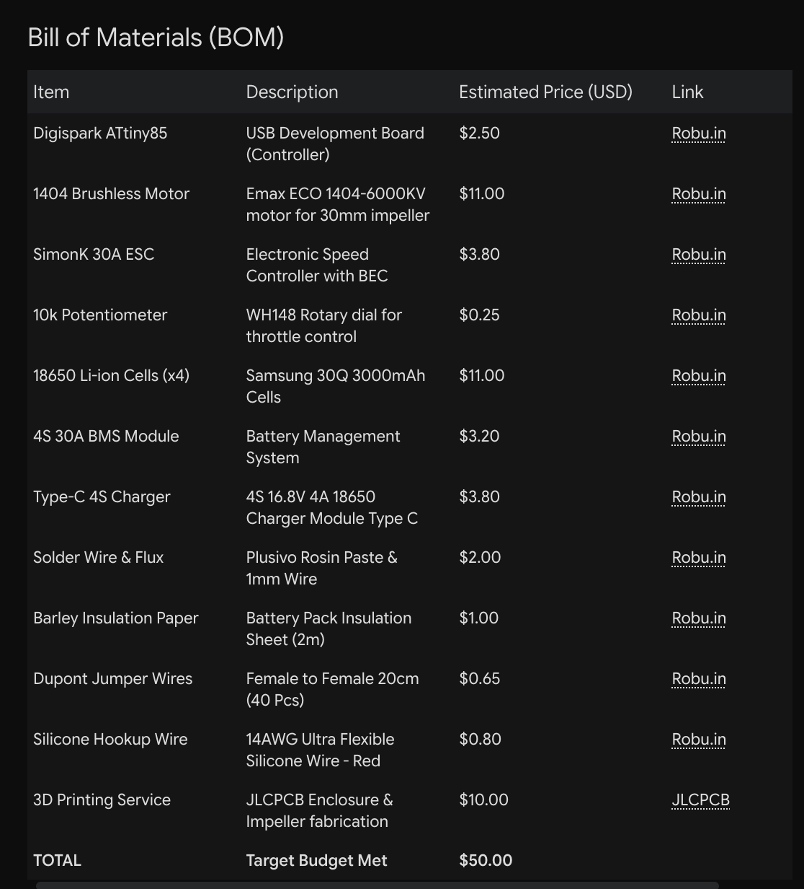
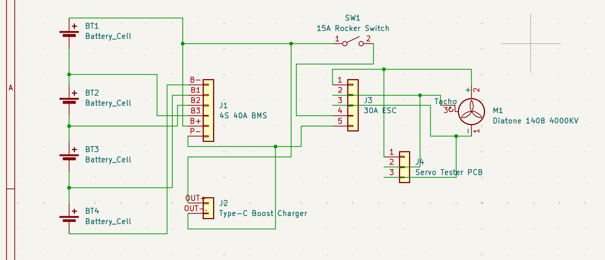
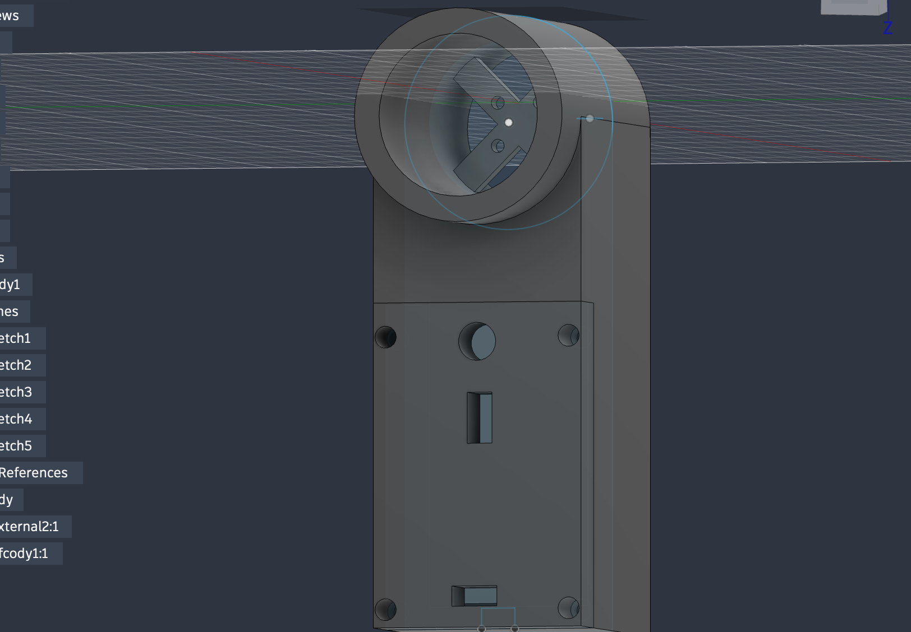

**September 26, 2026: Component Research & Budget OptimizationTime**
Spent: 0.8 Hours
My primary goal for this session was to finalize the hardware selection for the turbo fan while strictly adhering to the $50 budget constraint. Instead of sourcing parts internationally and risking heavy import fees or shipping delays, I prioritized finding the cheapest and best components available from local domestic electronics markets.
I utilized AI to rapidly cross-reference part availability and balance the Bill of Materials (BOM). To build a highly capable handheld vacuum and impeller test rig, I had to carefully calculate the powertrain costs. I settled on an Emax ECO 1404-6000KV brushless motor and a 30A SimonK ESC because they deliver the high RPM required for a 30mm impeller at a fraction of the cost of premium drone parts. For power delivery, I selected high-drain Samsung 30Q 18650 cells. Balancing these local component costs down to the cent allowed me to reserve exactly $10 for custom 3D printing services and integrate a dedicated Type-C charging module, keeping the total BOM at exactly $50.00

**September 26, 2026: Point-to-Point Schematics & Airflow Strategy**
Time Spent: 1.0 Hour
For this session, I focused on drafting the electrical connections in KiCad. Because the primary goal of this project is to build a high-speed fan capable of functioning as a vacuum, the core engineering challenge lies in fluid dynamics—specifically, balancing static air pressure against the total volume of air displaced. Since the performance of the system depends almost entirely on the mechanical 3D design of the propeller (impeller) and enclosure, I decided to avoid fabricating a custom PCB. Instead, I created a clean point-to-point wiring schematic mapping the connections for a dedicated PWM controller and the 30A ESC. This approach keeps the electronics budget low and allows me to allocate more time to the complex CAD work required for optimal airflow. 

**September 26, 2026: 7-Blade Impeller CAD Design**
Time Spent: 1.1 Hours
This session was dedicated to designing the most crucial mechanical component of the entire project: the impeller. I modeled a custom 7-blade impeller in Fusion 360, specifically tailored to mount onto the shaft of the BLDC motor.   The primary engineering challenge during this phase was optimizing the blade geometry to strike the perfect balance between static pressure generation and overall air volume displacement. A standard flat-pitch blade would simply chop the air and create turbulence, so I focused on a swept, curved blade profile that actively channels and compresses the air as it accelerates outward. This specific 7-blade configuration ensures consistent, smooth airflow at high RPMs while maximizing the efficiency of the motor within the tight tolerances of the planned 30mm enclosure.  

**September 27, 2026: Main Body Enclosure & Component Integration**
Time Spent: 1.0 Hour   
In this session, I focused on designing the primary structural housing for the impeller rig. The goal was to create a unified main body capable of securely mounting the motor assembly while providing precisely toleranced internal compartments for the 18650 battery pack and all control electronics.   
The CAD process required significant troubleshooting. Attempting to seamlessly integrate the bulky Li-ion cells, the 30A ESC, and the PWM controller into a compact, hand-held form factor resulted in multiple interference and geometric errors in Fusion 360. I spent the majority of the hour resolving these spatial conflicts, adjusting wall thicknesses, and fixing overlapping body warnings to ensure the final STL file would be fully optimized and structurally sound for 3D printing.  

**September 27, 2026: Interface Cutouts & Ergonomic Handle Design**
Time Spent: 1.5 Hours

In this session, I finalized the CAD for the main body by focusing on component integration, wire routing, and user ergonomics. I designed precise cutouts and extrusions along the housing to securely mount the external interface components: the power switches, the PWM speed controller dial, and the Type-C USB charging module.   
To ensure clean and safe cable management, I engineered a dedicated routing hole connecting the motor housing to the main electronics compartment, allowing the brushless motor wires to pass through without getting pinched or obstructing airflow. Finally, I focused on the physical feel of the device; because this turbo fan will generate noticeable thrust, I heavily filleted and rounded the handle profile to ensure a secure, comfortable ergonomic grip during handheld operation.

**September 29, 2026: CAD Refinement & Microcontroller Pivot**
Time Spent: 1.0 Hour

During this session, I heavily refined the main 3D body, polishing the external features while precisely mapping the internal compartments to house the entire power plant: the four 18650 Li-ion batteries, the BMS, and the Type-C charging module.   
A major engineering pivot occurred regarding the electronics. I realized that using an off-the-shelf PWM speed controller module would be too bulky for the ergonomic handle. Since I am strictly avoiding custom PCB fabrication to cut costs and adhere to the grant budget, I cannot solder raw SMD chips. Instead, I swapped the bulky controller for a Digispark ATtiny85 development board paired with a simple rotary potentiometer. This allows me to write custom firmware to generate the ESC signal, maintaining a highly compact, point-to-point wiring architecture that easily fits inside the refined CAD model.

**September 29, 2026: Final Assembly CAD & Ergonomic Details**
Time Spent: 0.7 Hours

n this final design session, I completed the full CAD assembly of the impeller rig. My main objective was arranging the remaining internal components into their designated compartments.   
I also heavily refined the external housing. To make the handheld fan comfortable to hold, I applied rounded corners across the profile. Additionally, I carved out precise mounting grooves for the external interface, specifically tailoring the cutouts to flush-mount the Type-C charging module, the power button, and the rotary speed control knob. With the CAD now fully polished and the files ready for production, the design phase of this project is officially complete.   

