# Mini Turbo Hand Fan & Vacuum (30mm Impeller Rig)

### Project Overview
This project is a high-speed, multi-purpose mini turbo hand fan capable of doubling as a handheld vacuum cleaner. It is powered by a high-RPM Brushless DC (BLDC) motor controlled by a 30A ESC and an ATtiny85 microcontroller. The core of the project features a custom-designed 30mm impeller, mechanically optimized in Fusion 360 to perfectly balance static pressure and air volume displacement. 

While commercial turbo jet fans with similar performance cost upwards of $70–$80, this project was engineered from the ground up to be fully fabricated for **strictly under $50.00**. It features a custom 3D-printed enclosure housing a rechargeable 4S 18650 Li-ion battery power plant, integrated with a Battery Management System (BMS) and Type-C charging for maximum safety, longevity, and portability.

---

### Hardware & 3D Design Details

**The Impeller**
This is the custom 7-blade impeller designed to mount onto the BLDC motor shaft. It is mechanically optimized to balance high static pressure with maximum air volume displacement, allowing the device to act as both a powerful fan and a vacuum.
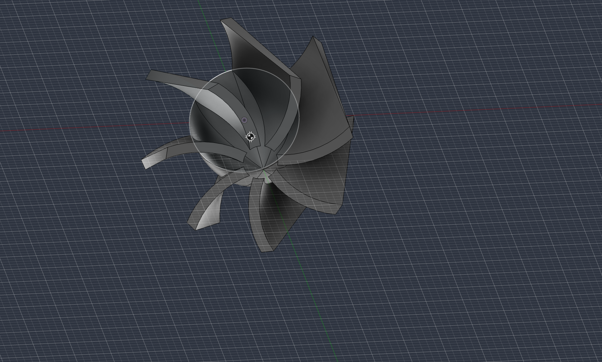
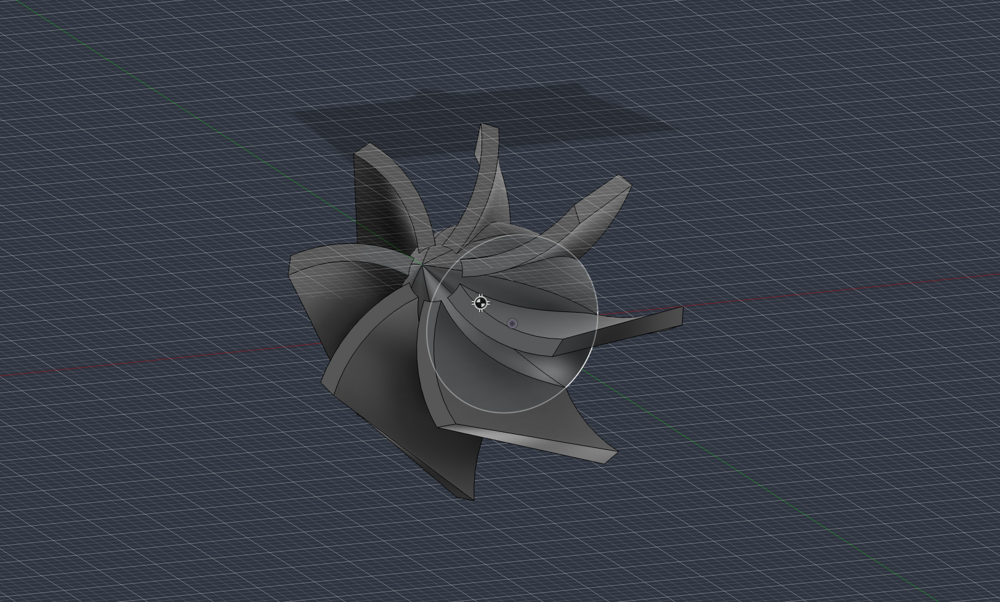

**The Full Main Body**
This is the main body shell of the fan. It features a heavily filleted, ergonomic handle for a comfortable grip during high-thrust operation, along with precise external cutouts for the power button, speed control knob, and Type-C charging module.
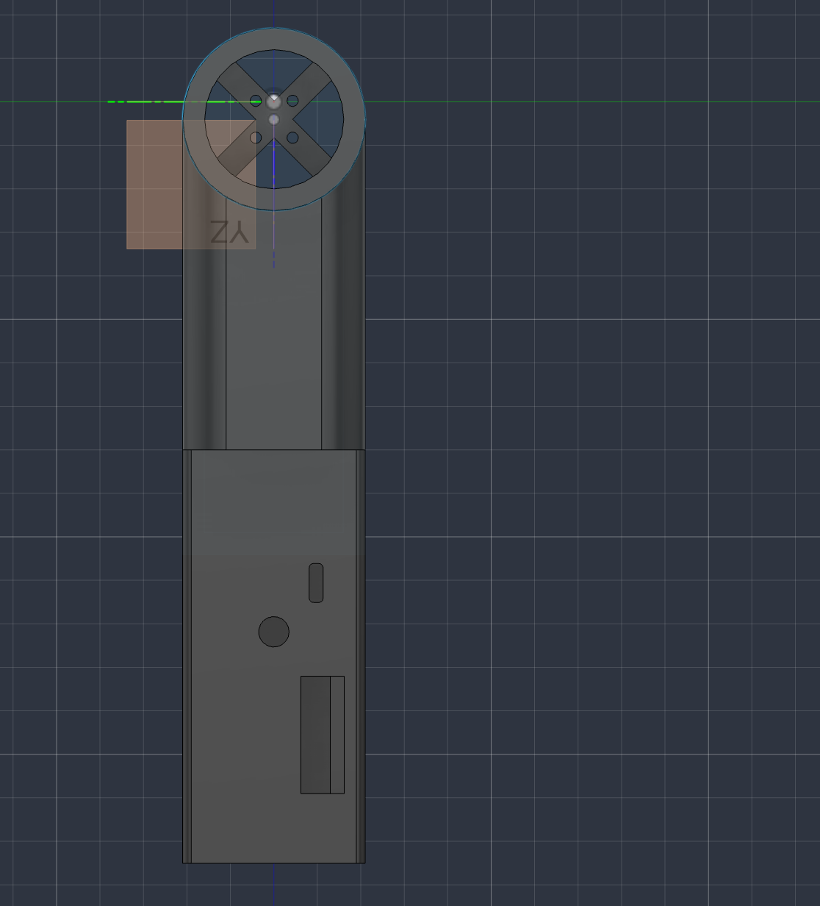

**Internal Battery Compartment**
This is the internal layout showing the dedicated compartments designed to securely house the four 18650 Li-ion cells, the BMS, and all routed wiring without obstructing the main airflow.
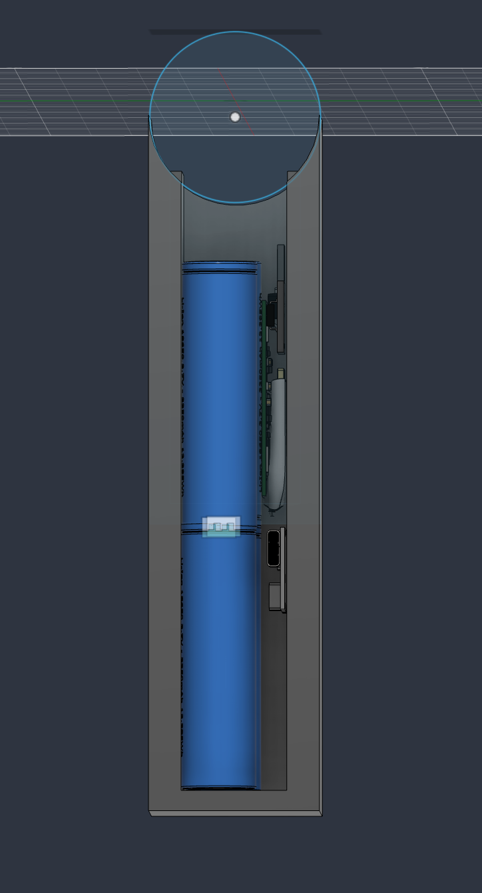

**Final Assembly**
This is the final CAD assembly showing how the motor housing, impeller, and ergonomic handle all fit perfectly together into a single, compact handheld unit.
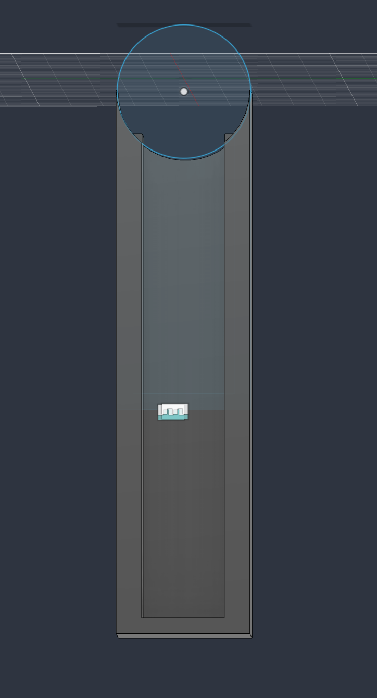
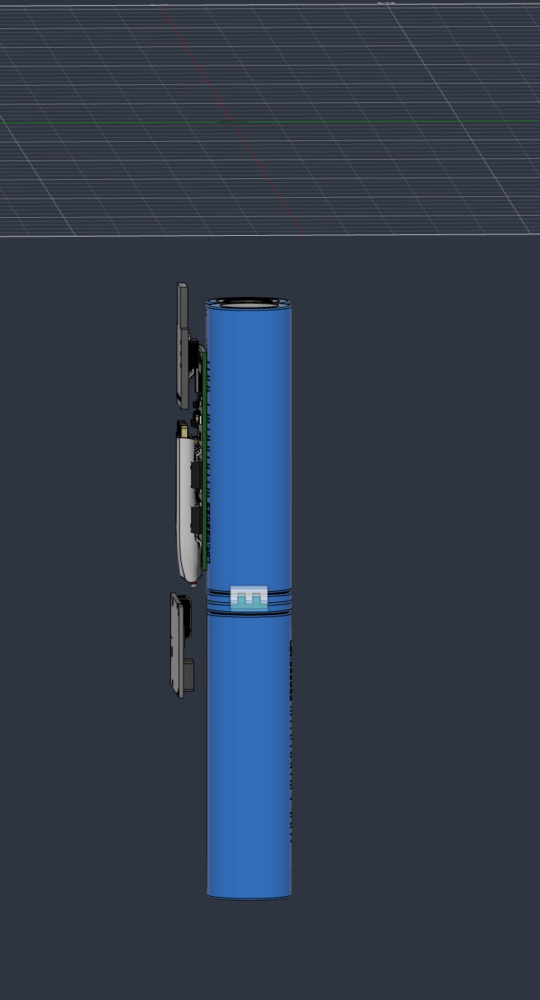

---

### Wiring & Electronics

**Point-to-Point Schematic**
This is the finalized electrical schematic. To strictly maintain the $50.00 budget limit, we bypassed expensive custom PCB fabrication. Instead, I designed a clean point-to-point wiring architecture connecting the ATtiny85, the 30A ESC, and the 4S battery management system.
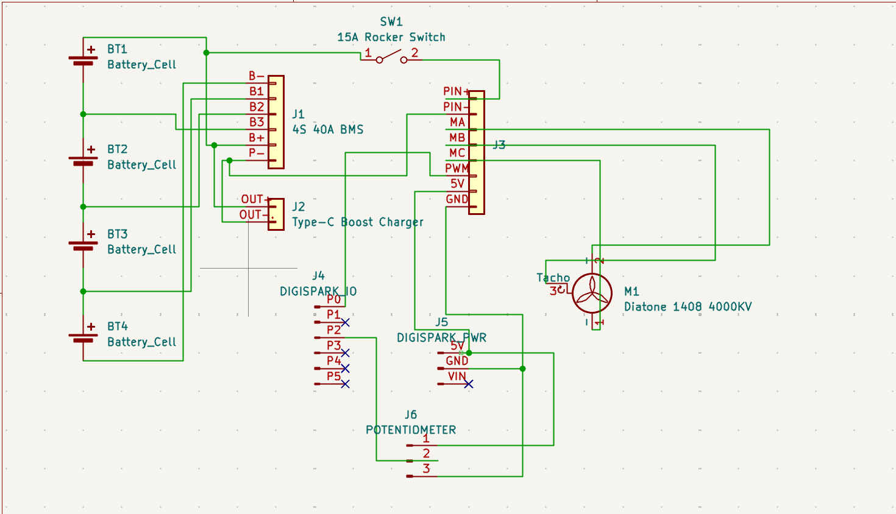

## Final #D CAD view 

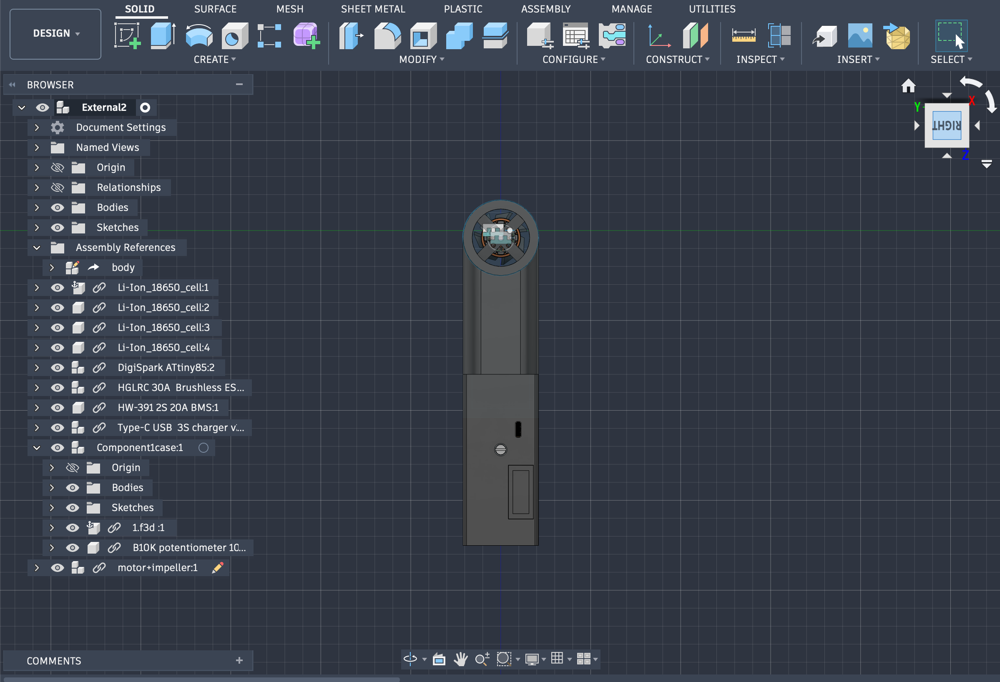
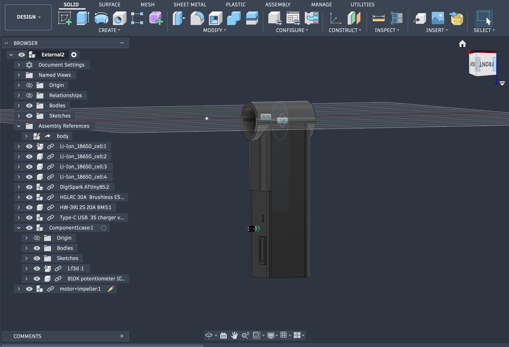
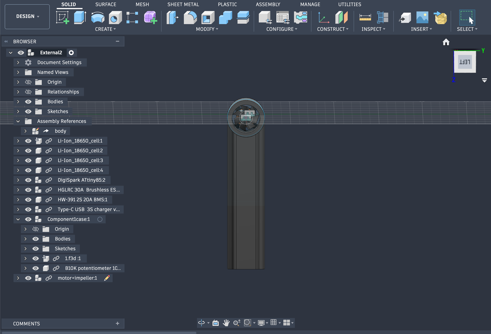
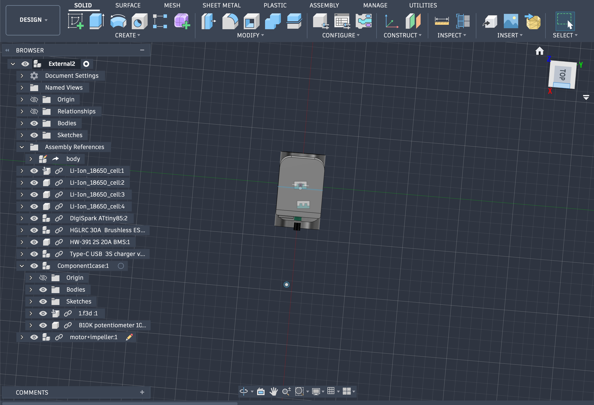  s
---

### Bill of Materials (BOM)
Our BOM has been carefully balanced using local sourcing to hit an exact $50.00 budget, leaving exactly enough room for custom 3D printing services.

| Item | Description | Estimated Price (USD) | Link |
| :--- | :--- | :--- | :--- |
| Digispark ATtiny85 | USB Development Board (Controller) | $2.50 | [Robu.in](https://robu.in/product/attiny85-usb-development-board/) |
| 1404 Brushless Motor | Emax ECO 1404-6000KV motor for 30mm impeller | $11.00 | [Robu.in](https://robu.in/product/emax-eco-1404-6000kv-brushless-motor/) |
| SimonK 30A ESC | Electronic Speed Controller with BEC | $3.80 | [Robu.in](https://robu.in/product/30a-bldc-esc-electronic-speed-controller/) |
| 10k Potentiometer | WH148 Rotary dial for throttle control | $0.25 | [Robu.in](https://robu.in/product/wh148-potentiometer-10k-15mm-shaft/) |
| 18650 Li-ion Cells (x4)| Samsung 30Q 3000mAh Cells | $11.00 | [Robu.in](https://robu.in/product/samsung-18650-30q-li-ion-battery/) |
| 4S 30A BMS Module | Battery Management System | $3.20 | [Robu.in](https://robu.in/product/4-series-30a-18650-lithium-battery-protection-board-14-8v-16v-with-cable/) |
| Type-C 4S Charger | 4S 16.8V 4A 18650 Charger Module Type C | $3.80 | [Robu.in](https://robu.in/product/4s-16-8v-4a-18650-lithium-battery-charger-module-type-c/) |
| Solder Wire & Flux | Plusivo Rosin Paste & 1mm Wire | $2.00 | [Robu.in](https://robu.in/product/plusivo-solder-wire-1mm-100g-and-rosin-paste-flux-for-pcb-electrical-soldering/) |
| Barley Insulation Paper| Battery Pack Insulation Sheet (2m) | $1.00 | [Robu.in](https://robu.in/product/barley-insulation-paper-sheet-100mm-2-meter/) |
| Dupont Jumper Wires | Female to Female 20cm (40 Pcs) | $0.65 | [Robu.in](https://robu.in/product/acebott-20cm-dupont-wire-40pin-female-to-female/) |
| Silicone Hookup Wire | 14AWG Ultra Flexible Silicone Wire - Red | $0.80 | [Robu.in](https://robu.in/product/high-quality-ultra-flexible-14awg-silicone-wire-red/) |
| 3D Printing Service | JLCPCB Enclosure & Impeller fabrication | $10.00 | [JLCPCB](https://jlcpcb.com/3d-printing) |
| **TOTAL** | **Target Budget Met** | **$50.00** | |

---

### Tool Grant Request: Soldering Iron
To bring this project from the CAD and schematic phase into physical production, **I am respectfully requesting a grant for a new soldering iron**. 

I previously owned one, but it is no longer functional. Because I prioritized hitting the strict $50.00 budget cap with the necessary motors, power management systems, and 3D printing services, I was unable to allocate funds for replacement tooling within the primary BOM. A reliable soldering iron is absolutely essential for assembling the point-to-point wiring, attaching the BMS to the 18650 cells, and safely distributing power to the 30A ESC.